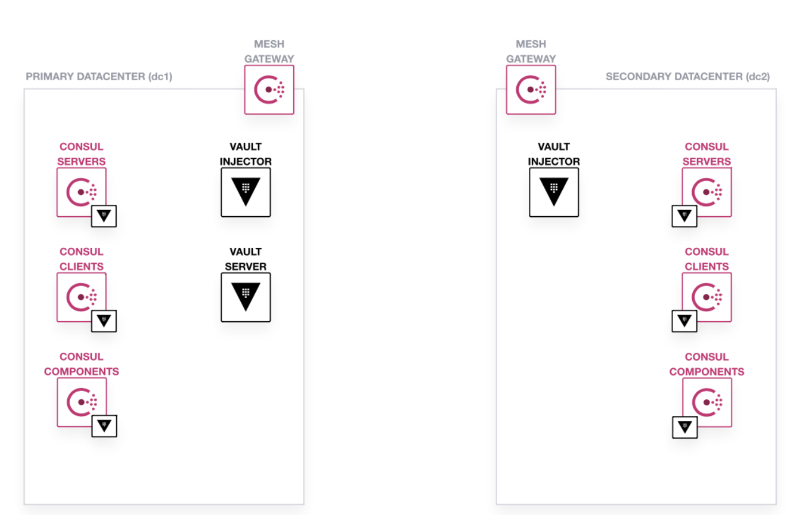
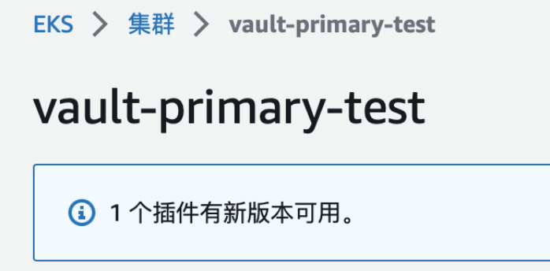

#k8s实践 

https://developer.hashicorp.com/consul/docs/k8s/deployment-configurations/vault/wan-federation
https://computingforgeeks.com/how-to-integrate-multiple-kubernetes-clusters-to-vault-server/



## 创建EKS实例

首先登录rwc-test 这个aws账户，在EKS中，创建两个实例，并为实例添加EKS节点组


运行以下的命令将eks 添加到本地的kubeconfig
``` shell
aws eks update-kubeconfig --region ap-northeast-1 --name vault-primary-test
```
另一个集群 `vault-sencondary-test` 也是如此
```shell
aws eks update-kubeconfig --region ap-northeast-1 --name vault-secondary-test
```

进行集群连接情况的测试
``` shell
k config get-contexts
k config use-context xxx
kg po -A
# NAMESPACE     NAME                       READY   STATUS    RESTARTS   AGE
# kube-system   aws-node-shhxn             1/1     Running   0          8m29s
# kube-system   coredns-5fc8d4cdcf-hgp6r   1/1     Running   0          52m
# kube-system   coredns-5fc8d4cdcf-kmfs6   1/1     Running   0          52m
# kube-system   kube-proxy-sstwq           1/1     Running   0          8m29s
```

成功连接两个集群后，接下来将尝试在primary 集群中部署一个dev vault (注意，部署的并不是高可用版本的Vault)，并且使用该vault同时管理primary和secondary 两个集群。


## 在Primary集群中部署Vault
#### 准备Vault配置文件
``` yaml
# vault-primary.yaml
server:
  dev:
    enabled: true
  service:
    enabled: true
    type: LoadBalancer
ui:
  enabled: true
```

#### Helm install vault
按照配置文件进行helm install，这里相比官网的教程做了一些修改，主要是修改了service name和namespace
``` shell
helm repo add hashicorp https://helm.releases.hashicorp.com
helm install vault-primary --values vault-primary.yaml hashicorp/vault --namespace vault --wait
```
查看安装情况
``` shell
kg po -n vault
# NAME                                           READY   STATUS    RESTARTS   AGE
# vault-primary-0                                1/1     Running   0          59s
# vault-primary-agent-injector-fb4677bf8-47nz7   1/1     Running   0          59s
```

本地Vault Client 连接测试
``` shell
# EKS
export VAULT_SERVER_HOST=$(kubectl get svc vault-primary -n vault -o jsonpath='{.status.loadBalancer.ingress[0].hostname}')
export VAULT_ADDR=http://${VAULT_SERVER_HOST}:8200
export VAULT_TOKEN=root #default
vault status
```

#### Vault kv-v2 配置
配置 Primary Cluster上的Vault，启动kv-v2 secret engine，这里的path是测试的时候随便填的，后续要根据自己的需求更改
``` shell
vault secrets enable -path=test kv-v2
vault kv put test/foo/bar hello='world'
vault kv get test/foo/bar # 正常应该是可以看到存入的hello='world'
```

#### 配置Kubernetes Auth
- upgrade vault，安装injector
修改配置文件，添加有关injector的配置
``` yaml
# vault-primary.yaml
server:
  dev:
    enabled: true
  service:
    enabled: true
    type: LoadBalancer
injector:
  enabled: true
  authPath: auth/kubernetes-primary
ui:
  enabled: true
```
开启kubernetes auth
``` shell
vault auth enable -path=kubernetes-primary kubernetes
```
helm upgrade（这里发现必须开两个eks node才能upgrade成功）
``` shell
helm upgrade vault-primary --values vault-primary.yaml --namespace vault hashicorp/vault --wait
```

配置kubernetes auth
``` shell
vault write auth/kubernetes-primary/config kubernetes_host=https://kubernetes.default.svc
```

设置policy
``` shell
vault policy write internal-app - <<EOF
path "test/*" {
   capabilities = ["read"]
}
EOF
```
创建vault role和对应的service account
``` shell
vault write auth/kubernetes-primary/role/vault-primary-auth-sa \
     bound_service_account_names=vault-primary-auth-sa \
     bound_service_account_namespaces=default \
     policies=internal-app \
     ttl=24h

k create sa internal-app
```

## 测试Primary 集群中的Vault inject

#### 部署测试应用
我们在primary cluster中创建一个deployment
``` yaml
# dep-orgchart.yaml
apiVersion: apps/v1
kind: Deployment
metadata:
  name: orgchart
  labels:
    app: orgchart
spec:
  selector:
    matchLabels:
      app: orgchart
  replicas: 1
  template:
    metadata:
      annotations:
      labels:
        app: orgchart
    spec:
      serviceAccountName: vault-primary-auth-sa
      containers:
        - name: orgchart
          image: jweissig/app:0.0.1
```

```shell
k apply -f dep-orgchart.yaml
```

#### 通过Annotation进行secret inject

和之前一样，给deployment打上一个patch，通过annotation来进行secret的注入
``` yaml
# patch-inject-secrets.yaml
spec:
  template:
    metadata:
      annotations:
        vault.hashicorp.com/agent-inject: 'true'
        vault.hashicorp.com/role: 'vault-primary-auth-sa'
        vault.hashicorp.com/auth-path: 'auth/kubernetes-primary'
        vault.hashicorp.com/agent-inject-secret-test-secret.txt: 'test/data/foo/bar'
```

``` shell
k patch deployment orgchart --patch "$(cat patch-inject-secrets.yaml)"
```

#### 查看应用内的Secret
``` shell
k exec -it orgchart-6dbc7b6c96-67vpg -c orgchart -- cat /vault/secrets/test-secret.txt
# data: map[hello:world]
# metadata: map[created_time:2023-01-05T03:38:24.502229035Z custom_metadata:<nil> deletion_time: destroyed:false version:1]
```
正确输出了secret

## 在Secondary集群中部署Vault

secondary集群中的vault不包含vault server，只有vault injector，而是使用primary集群中的vault server作为external server

#### 准备Vault配置文件
``` yaml
# vault-secondary.yaml
server:
  enabled: false
injector:
  enabled: true
  externalVaultAddr: ${VAULT_ADDR} #! 注意这里要填真实地址，不能填环境变量，不识别
  authPath: auth/kubernetes-secondary

```

#### Helm install vault
``` shell
helm install vault-secondary --values vault-secondary.yaml hashicorp/vault --namespace vault --wait
```
查看安装情况，应该是只有vault-injector pod
``` shell
kg po -n vault
# NAME                                             READY   STATUS    RESTARTS   AGE
# vault-secondary-agent-injector-f74bc9887-kvgxp   1/1     Running   0          32s
```

#### 配置Kubernetes Auth
``` shell
vault auth enable -path=kubernetes-secondary kubernetes
```

在secondary cluster中创建sa和对应的clusterrole binding
``` yaml
# auth-secondary.yaml
apiVersion: rbac.authorization.k8s.io/v1
kind: ClusterRoleBinding
metadata:
  name: vault-secondary-auth-method
roleRef:
  apiGroup: rbac.authorization.k8s.io
  kind: ClusterRole
  name: system:auth-delegator
subjects:
- kind: ServiceAccount
  name: vault-secondary-auth-sa
  namespace: default
---
apiVersion: v1
kind: ServiceAccount
metadata:
  name: vault-secondary-auth-sa
  namespace: default
---
#! 注意：在K8s 1.24中，不会为SA自动生成secret，所以必须手动创建
# FYI: https://stackoverflow.com/questions/72256006/service-account-secret-is-not-listed-how-to-fix-it
apiVersion: v1
kind: Secret
metadata:
  name: vault-sa-secret
  namespace: default
  annotations:
    kubernetes.io/service-account.name: "vault-secondary-auth-sa"
type: kubernetes.io/service-account-token

```

``` shell
k apply -f auth-secondary.yaml
kg sa
# NAME                      SECRETS   AGE
# default                   0         124m
# vault-secondary-auth-sa   0         3s
```

关键步骤，创建完SA之后，需要向Primary cluster中的Vault server提供Secondary cluster的K8s host，SA cert以及SA的JWT token

``` shell
export K8S_SECONDARY_CA_CERT="$(kubectl get secret vault-sa-secret --output jsonpath='{.data.ca\.crt}' | base64 --decode)"
export K8S_SECONDARY_JWT_TOKEN="$(kubectl get secret vault-sa-secret --output jsonpath='{.data.token}' | base64 --decode)"
export KUBE_API_URL_SECONDARY=$(kubectl config view --output jsonpath="{.clusters[?(@.name == \"$(kubectl config current-context)\")].cluster.server}")
```

关键步骤，向Vault 写入auth config
``` shell
vault write auth/kubernetes-secondary/config \
  kubernetes_host="${KUBE_API_URL_SECONDARY}" \
  token_reviewer_jwt="${K8S_SECONDARY_JWT_TOKEN}" \
  kubernetes_ca_cert="${K8S_SECONDARY_CA_CERT}"
```
并设置policy
``` shell
vault write auth/kubernetes-secondary/role/vault-secondary-auth-sa \
     bound_service_account_names=vault-secondary-auth-sa \
     bound_service_account_namespaces=default \
     policies=internal-app \
     ttl=24h
```
这里使用的policy和primary cluster中的policy相同


## 测试 Secondary 集群中的Vault

#### 部署测试应用
```yaml
# dep-orgchart-secondary.yaml
apiVersion: apps/v1
kind: Deployment
metadata:
  name: orgchart
  labels:
    app: orgchart
spec:
  selector:
    matchLabels:
      app: orgchart
  replicas: 1
  template:
    metadata:
      annotations:
      labels:
        app: orgchart
    spec:
      serviceAccountName: vault-secondary-auth-sa # 注意
      containers:
        - name: orgchart
          image: jweissig/app:0.0.1
```

``` shell
k apply -f dep-orgchart-secondary.yaml
```

同样，修改annotataion
``` yaml
spec:
  template:
    metadata:
      annotations:
        vault.hashicorp.com/agent-inject: 'true'
        # 注意auth path 和 role
        vault.hashicorp.com/auth-path : 'auth/kubernetes-secondary'
        vault.hashicorp.com/role: 'vault-secondary-auth-sa'
        vault.hashicorp.com/agent-inject-secret-test-secret.txt: 'test/data/foo/bar'
```

``` shell
k patch deployment orgchart --patch "$(cat patch-inject-secrets-secondary.yaml)"
```

最后，查看pod中的secret是否被正确的挂载
``` shell
k exec -it orgchart-666748bf-zslbg -c orgchart -- cat /vault/secrets/test-secret.txt
# data: map[hello:world-v2]
# metadata: map[created_time:2023-01-05T04:23:14.557566498Z custom_metadata:<nil> deletion_time: destroyed:false version:2]
```

## 总结

#### 注意点

1. K8s 1.24 后 SA 不会自动生成secret，需要手动创建
2. 概念
	1. Auth PATH: 通过不同AUTH PATH区分不同的集群中的vault injector
	2. Policy: 指定权限，类似于K8s中的Role，就是说可以做什么，比如读某个kv path下的东西
	3. Role： 绑定一个SA和Policy
3. 需要在annotation中填入对应的role，authpath，以及正确设置pod的serviceaccount，才能正确的访问vault

#### 参考
https://developer.hashicorp.com/consul/docs/k8s/deployment-configurations/vault/wan-federation
https://computingforgeeks.com/how-to-integrate-multiple-kubernetes-clusters-to-vault-server/